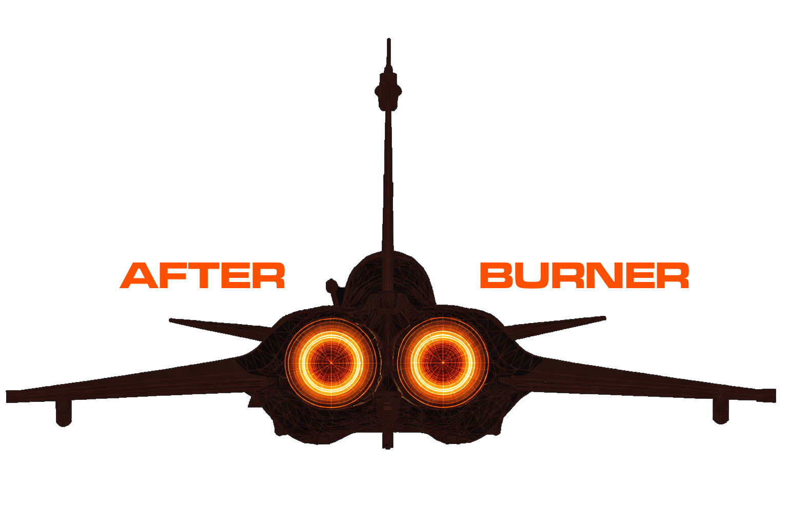

# Afterburner

<h3 align="center">
  
</h3>

  <a href="https://en.wikipedia.org/wiki/International_orange#Aerospace">International Orange</a> color themes for developers — built around <code>#FF4F00</code>, the color of NASA flight suits, the Bell X-1, and Chuck Yeager's sound barrier run.

  <a href="#-palette">Palette</a>
  ·
  <a href="#-ports">Ports</a>
  ·
  <a href="#-installation">Installation</a>
  ·
  <a href="#-design-decisions">Design Decisions</a>

&nbsp;

### Design philosophy

International Orange was not chosen for aesthetics.
It was specified — by engineers, for engineers — because it is the most visible color against any background: sky, fog, ocean, or darkness.
_Conspicuity_ is the technical term.
It means: cannot be missed.

That is the standard these themes are held to.

Every color earns its place through function.
Keywords command the full <code>#FF4F00</code> — the loudest signal, reserved for what the language itself is saying.
Functions step back to amber.
Types recede to warm gray, a temperature-matched neutral that reads as present but not shouting.
Numbers take teal — the maximum hue distance from orange in the palette, snapping into focus instantly.
The hierarchy is not decorative.
It is load-bearing.
The backgrounds are not black and white.
Both are calibrated to the accent, not chosen by default.

The error color is International Orange (Engineering) <code>#BA160C</code> — the Golden Gate Bridge.
Same lineage, different application: danger must be distinguishable from emphasis without abandoning the palette.
It is the one color identical in both themes, because it already achieves correct contrast on both backgrounds and semantic consistency outweighs variation.

No color in this suite was chosen because it looked nice.
Each one was derived, tested, and held to a reason.

&nbsp;

### 🎨 Palette

Two variants, one identity. The accent is always International Orange. The background changes; the character doesn't.

🔥 Afterburner (dark)

<table>
	<tr>
		<th></th>
		<th>Labels</th>
		<th>Hex</th>
	</tr>
	<tr>
		<td></td>
		<td>Background</td>
		<td><code>#0D0D0D</code></td>
	</tr>
	<tr>
		<td></td>
		<td>Foreground</td>
		<td><code>#E0E0E0</code></td>
	</tr>
	<tr>
		<td></td>
		<td>Primary</td>
		<td><code>#FF4F00</code></td>
	</tr>
	<tr>
		<td></td>
		<td>Orange Mid</td>
		<td><code>#FF7A33</code></td>
	</tr>
	<tr>
		<td></td>
		<td>Orange Pale</td>
		<td><code>#FFB380</code></td>
	</tr>
	<tr>
		<td></td>
		<td>Cursor</td>
		<td><code>#CC3F00</code></td>
	</tr>
	<tr>
		<td></td>
		<td>Selection</td>
		<td><code>#2A1500</code></td>
	</tr>
	<tr>
		<td></td>
		<td>Red</td>
		<td><code>#BA160C</code></td>
	</tr>
	<tr>
		<td></td>
		<td>Green</td>
		<td><code>#5FBF7E</code></td>
	</tr>
	<tr>
		<td></td>
		<td>Amber</td>
		<td><code>#E09B30</code></td>
	</tr>
	<tr>
		<td></td>
		<td>Teal</td>
		<td><code>#4DBFA8</code></td>
	</tr>
	<tr>
		<td></td>
		<td>Blue</td>
		<td><code>#4A8AB5</code></td>
	</tr>
	<tr>
		<td></td>
		<td>Purple</td>
		<td><code>#A07DE0</code></td>
	</tr>
	<tr>
		<td></td>
		<td>Warm Gray</td>
		<td><code>#A89888</code></td>
	</tr>
</table>

🌅 Fogburn (light)

<table>
	<tr>
		<th></th>
		<th>Labels</th>
		<th>Hex</th>
	</tr>
	<tr>
		<td></td>
		<td>Background</td>
		<td><code>#F5F0EB</code></td>
	</tr>
	<tr>
		<td></td>
		<td>Foreground</td>
		<td><code>#2A2218</code></td>
	</tr>
	<tr>
		<td></td>
		<td>Primary</td>
		<td><code>#C94000</code></td>
	</tr>
	<tr>
		<td></td>
		<td>Orange Mid</td>
		<td><code>#D45A00</code></td>
	</tr>
	<tr>
		<td></td>
		<td>Orange Pale</td>
		<td><code>#B87040</code></td>
	</tr>
	<tr>
		<td></td>
		<td>Cursor</td>
		<td><code>#A33200</code></td>
	</tr>
	<tr>
		<td></td>
		<td>Selection</td>
		<td><code>#EDE5DC</code></td>
	</tr>
	<tr>
		<td></td>
		<td>Red</td>
		<td><code>#BA160C</code></td>
	</tr>
	<tr>
		<td></td>
		<td>Green</td>
		<td><code>#2E7D4F</code></td>
	</tr>
	<tr>
		<td></td>
		<td>Amber</td>
		<td><code>#9A6A10</code></td>
	</tr>
	<tr>
		<td></td>
		<td>Teal</td>
		<td><code>#2D8C7A</code></td>
	</tr>
	<tr>
		<td></td>
		<td>Blue</td>
		<td><code>#2A6A9A</code></td>
	</tr>
	<tr>
		<td></td>
		<td>Purple</td>
		<td><code>#7058C0</code></td>
	</tr>
	<tr>
		<td></td>
		<td>Warm Gray</td>
		<td><code>#A89888</code></td>
	</tr>
</table>

&nbsp;

### 📦 Ports

Available for the following tools and applications:

🖥️ Terminals

- [Ghostty](./ports/ghostty/)
- [Kitty](./ports/kitty/)
- [WezTerm](./ports/wezterm/)

💻 Editors & IDEs

- [Helix](./ports/helix/)
- [Sublime Text](./ports/sublime-text/)

🐚 Shells & CLI

- [Fish shell](./ports/fish/)
- [Starship](./ports/starship/)
- [Eza](./ports/eza/)
- [Bat](./ports/bat/)

🔧 Development Tools

- [OpenCode](./ports/opencode/)

&nbsp;

### 📜 Credits

- [International Orange (Aerospace)](https://en.wikipedia.org/wiki/International_orange#Aerospace) — `#FF4F00`
- [International Orange (Engineering)](https://en.wikipedia.org/wiki/International_orange#Engineering) — `#BA160C`
- [Irving Morrow](https://en.wikipedia.org/wiki/Irving_Morrow) — architect of the Golden Gate Bridge, who chose the color
- [Chuck Yeager](https://en.wikipedia.org/wiki/Chuck_Yeager) — who flew the Bell X-1 through the sound barrier in an orange rocket plane on October 14, 1947

&nbsp;

*"The color was chosen for its visibility."*

